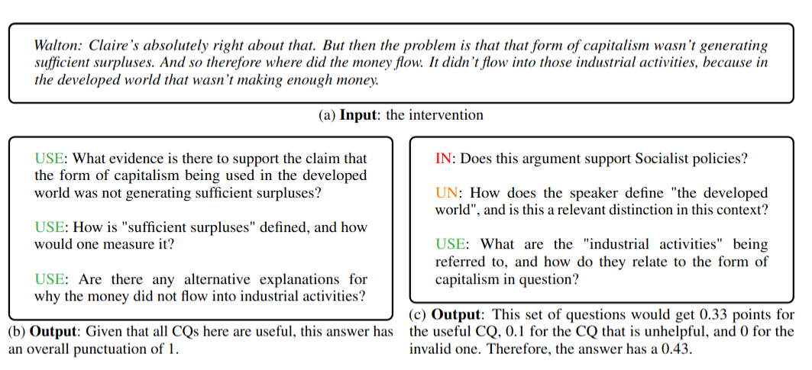

# Benchmarking Critical Questions Generation

This repository contains the code and resources for the paper:

[**Benchmarking Critical Questions Generation: A Chalenging Reasoning Task For Large Language Models**](https://arxiv.org/abs/2505.11341)  
[Blanca Calvo Figueras and Rodrigo Agerri, 2025]  

---

## Abstract

*The task of Critical Questions Generation (CQs-Gen) aims to foster critical thinking by enabling systems to generate questions that expose underlying assumptions and challenge the validity of argumentative reasoning structures. Despite growing interest in this area, progress has been hindered by the lack of suitable datasets and automatic evaluation standards. This paper presents a comprehensive approach to support the development and benchmarking of systems for this task. We construct the first large-scale dataset including ~5K manually annotated questions. We also investigate automatic evaluation methods and propose reference-based techniques as the strategy that best correlates with human judgments. Our zero-shot evaluation of 11 LLMs establishes a strong baseline while showcasing the difficulty of the task. Data and code plus a public leaderboard are provided to encourage further research, not only in terms of model performance, but also to explore the practical benefits of CQs-Gen for both automated reasoning and human critical thinking.*  

---

## Repository Structure

The repository is organized into three main folders:

- **`dataset-building/`**  
  Scripts and preprocessing utilities for constructing the dataset from source corpora (US2016, Moral Maze Debates, US2016reddit, Regulation Room Divisiveness).  
  This includes cleaning interventions, splitting them into manageable segments, and generating reference questions.

- **`eval-experiments/`**  
  Tools and scripts to evaluate generated questions.  
  We experiment with reference-based metrics, reference-based LLMs, and labeling LLMs.

- **`gen-experiments/`**  
  Experiments for generating critical questions using different LLMs (e.g., LLaMA, Claude, Gemma).  
  Contains prompt templates and baseline generation scripts.

---

## The Task

The task of **Critical Questions Generation (CQs-Gen)** is defined as follows:

- **Input:** An argumentative intervention (a short argumentative text).  
- **Output:** Exactly **3 critical questions** generated by the system.  

Each question is evaluated according to its ability to challenge the arguments of the text:  
- **USE (Useful):** The question can undermine or critically assess the argument.  
- **UN (Unhelpful):** The question is valid but unlikely to challenge the argument.  
- **IN (Invalid):** The question is invalid, unrelated, too general, or introduces new concepts not in the text.  

The final score for an intervention is based on how many of the 3 generated questions are labeled **USE**.



---

## Dataset Example

Each intervention consists of an argumentative text and a set of annotated critical questions.

```json
{
  "CLINTON_1_1": {
    "intervention_id": "CLINTON_1_1",
    "intervention": "CLINTON: \"The central question in this election is really what kind of country we want to be ...\"",
    "dataset": "US2016",
    "cqs": [
      {
        "id": 0,
        "cq": "What does the author mean by \"build an economy that works for everyone, not just those at the top\"?",
        "label": "Useful"
      },
      {
        "id": 1,
        "cq": "What is the author's definition of \"new jobs\" and \"good jobs\"?",
        "label": "Unhelpful"
      },
      {
        "id": 2,
        "cq": "How will the author's plan to \"make the economy fairer\" benefit the working class?"
        "label": "Invalid"
      }
    ]
  }
}
```

---

## Quickstart

### 1. Generate Questions

You can generate critical questions on the **validation set** using any Hugging Face model:

```bash
python gen-experiments/prompting_hf.py \
    --models $HF_MODEL \
    --input_path data/ \
    --input_set validation \
    --output_path gen-experiments/results/ \
    --prompt long
```

### 2. Evaluate with STS

Evaluation is done by comparing generated questions against the reference validation set with Semantic Text Similarity (STS).

```bash
python eval-experiments/with_metrics/evaluation.py \
    --metric similarity \
    --threshold 0.65 \
    --input_path data/validation.json \
    --submission_path gen-experiments/results/ \
    --submission_name $NAME \
    --output_path $OUTPUT_FOLDER
```

#### Notes on Evaluation

- `--threshold 0.65` ensures a generated question inherits the label of the most similar reference if the similarity is ≥ 0.65.  
- If no reference question passes the threshold, the generated question is labeled **not_able_to_evaluate**.  
- The intervention score is computed as:  
  - **1/3** if one generated question is `USE`  
  - **2/3** if two generated questions are `USE`  
  - **1** if all three generated questions are `USE`.  
- Final scores are aggregated across interventions.

---

## Leaderboard

🏆 Submit your system outputs to the [Critical Questions Generation Leaderboard](https://huggingface.co/spaces/HiTZ/Critical_Questions_Leaderboard)

## Citation

If you use this data or code please cite:

```

@inproceedings{figueras2025benchmarkingcriticalquestionsgeneration,
      title={Benchmarking Critical Questions Generation: A Challenging Reasoning Task for Large Language Models}, 
      author={Calvo Figueras, Banca and Rodrigo Agerri},
      year={2025},
      booktitle={2025 Conference on Empirical Methods in Natural Language Processing (EMNLP 2025)},
      organization={Association for Computational Linguistics (ACL)},
      url={https://arxiv.org/abs/2505.11341},
}

```
